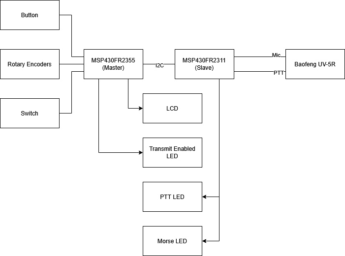
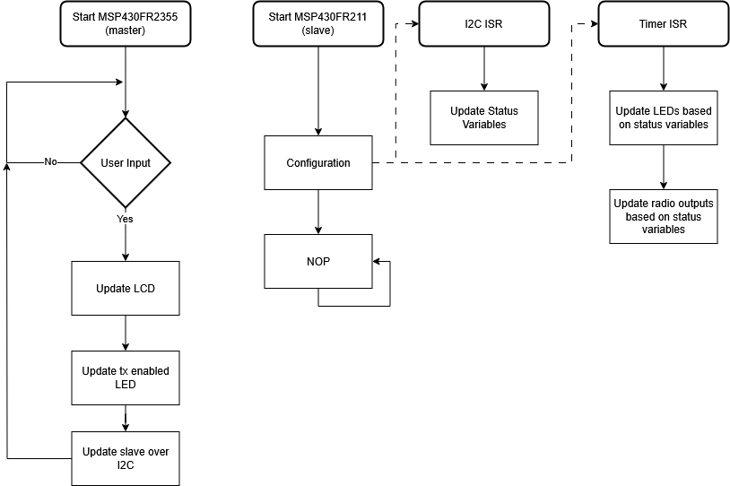

# Final project proposal

- [x] I have reviewed the project guidelines.
- [x] I will be working alone on this project.
- [x] No significant portion of this project will be (or has been) used in other course work.

## Embedded System Description

This project will create an amateur radio "fox". The MSP430 will control a Baofeng handheld radio to transmit a FM Morse code signal on the amateur radio band. This signal can then be used to for practice locating radio signal sources with directional antennas ("fox hunting").

The user will be able control the system by using two rotary encoders and a button to change settings displayed on the character LCD. There will also be a switch to quickly enable and disable transmitting.

The outputs will consist of an LCD for the user to input settings, the radio transmission, and three status LEDs. These LEDs will show when the user has transmission enabled, when the radio actually is transmitting (when the PTT signal is triggered), and the last the last one will flash out the morse code.

## Hardware Setup

The following is a block diagram showing how all the hardware involved in this project is connected.

## Software overview

The following flow chart shows a general overview of how the system software will work.

## Testing Procedure

I will use a second handheld radio to listen for the radio transmissions. I will vary the settings and listen for the change in the signal on the radio.

## Prescaler

Desired Prescaler level: 

- [ ] 100%
- [x] 95% 
- [ ] 90% 
- [ ] 85% 
- [ ] 80% 
- [ ] 75% 

### Prescalar requirements 

**Outline how you meet the requirements for your desired prescalar level**

**The inputs to the system will be:**
1.  Button
2.  Switch
3.  Rotary encoders x2

**The outputs of the system will be:**
1.   LCD
2.   LEDs
3.   Baofeng radio transmission

**The project objective is**

The object of this project is to create a amateur radio fox that transmits FM modulated Morse code on the 2 Meter band. The speed and content of the Morse code being transmitted will be adjustable.

**The new hardware or software modules are:**
1. A Baofeng radio. It must be controlled using analog inputs intended for a microphone and switch.
2. Rotary encoders will be used to interface with the system.

The Master will be responsible for:

All of the inputs. It will also be responsible for the LCD and one of the status LEDs.

The Slave(s) will be responsible for:

Controlling the Baofeng radio. It will also be responsible for the other two status LEDs not controlled by the master.

### Argument for Desired Prescaler

I believe this project will meet either the 90% or 95% prescaler. It has two new pieces of hardware, the rotary encoders and the Baofeng radio. The radio in particular will be difficult to control due to the analog nature of its inputs. Two approaches that will explored are generating a square wave with the MSP and then using an analog filtering circuit to create a sine wave, and finding a audio player that can interface with radio and be controlled by the MSP430.
